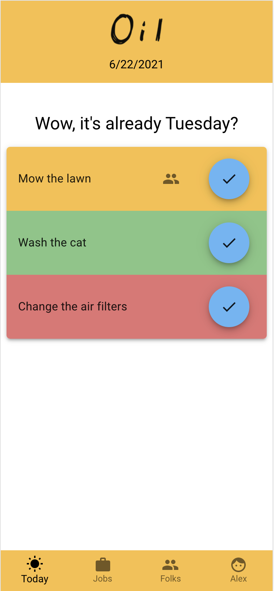
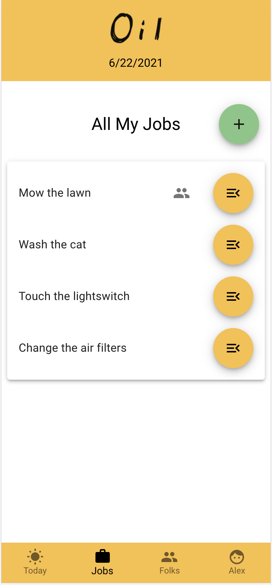
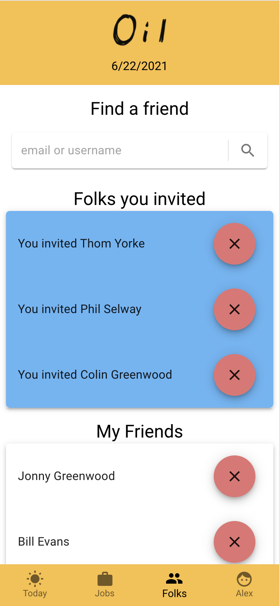

# Oil

### [Visit the deployed site](https://oil-client.netlify.app)
As a mobile first app, it looks best on a phone!

### [Server](https://github.com/SubtleCo/oil-server)

## Description

Oil is a full stack, mobile-first web application that reminds the user about long term maintenance commitments, such as watering a plant, oiling a lawnmower, cleaning out a fish tank, etc.

Authenticated users will create jobs consisting of:
- A title
- A brief description
- A frequency (how often does this job need to happen?)
- The date of the last time this job was completed (Today by default)
- The type of job (Maintenance, Yardwork, etc)

From then on, whenever a user logs on, they will be greeted with a list of jobs that need to be done. Simple as that! A user can then mark the job as completed from the main view once they're done.

Users can search for other users, become friends, and then share job responsibilities with each other. You gave the dog their meds? Great! Now it's marked out on both of our lists!

This app was absolutely born out of personal necessity. I've always been bad at following a manufactured's recommended maintenance, or remembering when the last time I changed the air filter was. This app is meant to be the ultimate set-and-forget reminders app for those things that you feel like it's about time to do, but no one really knows.

This project was bootstrapped with [Create React App](https://github.com/facebook/create-react-app) and [Django](https://www.djangoproject.com).

[Project Proposal](https://docs.google.com/document/d/1M-ca4kgNt_PwUpoWO7nD-wDve2ZKk1Ua0C4cONlftiA)

### Features

- Authorized users can create, edit, and remove jobs from their profile
- Authorized users can search for other users via email or username to add as a friend
- Confirmed friends can invite each other to share jobs
- When a user marks a job as complete, the job is updated with a "last completed" date of day, and "last completed by" becomes that user
- If users are sharing a job, marking the job as complete updates that job for everyone

#### Today View
- Jobs are shown with a green, yellow, or red background depending on urgency:
    - Jobs 0-2 days lapsed are green
    - Jobs 3-5 days lapsed are yellow
    - Jobs 6+ days are red
- If the job is shared with another user, a "shared" icon will appear
- A user can tap the checkmark on a job to "complete" it, resetting the countdown to the next time it will appear

### Background

When did I change the air filter? Did I already water the fern this week? How long has this gas been sitting in the mower? To be honest, I don't know the answer to any of these, but from here on out, I will. As I've grown older and taken on more responsibilities, I've struggled with how to keep track of these things. Calendar reminders won't let you mark something as completed, post-it notes get lost, and other apps can be overwhelming with features and possibilities. I wanted to build something that was absolutely nothing more than a recurring virtual task list. Given that we haven't figured out how to make a little spiral notebook that creates your checklist for you, I present: Oil

## Visual Samples

### Today

### Jobs

### Friends

## GIF Demo

## Installation

### Requirements

- [Node.js and npm](https://nodejs.org/en/download/)
- [Python](https://www.python.org)
- [Pipenv](https://pypi.org/project/pipenv/)
- Safari or a chromium-based browser. Might I recommend [Brave](https://brave.com)? ([Why not chrome?](https://chromeisbad.com))

### Instructions for Use - Client
1. Clone or fork this repository to your machine
2. change directories to `Oil/client/oil`
3. run `npm install` to install dependencies
4. run `npm start` to launch the react app

### Instructions for Use - [Server](https://github.com/SubtleCo/oil-server)
1. Make a copy of the `.env.example` file in the directory `Oil/server/oil/oil` and remove the .example extension.
2. Acquire an secret key for Django by running the following command:
`python -c 'from django.core.management.utils import get_random_secret_key; print(get_random_secret_key())'`
3. Insert the resulting secret key into your new `.env` file
4. Change directories to `Oil/server/oil` and star a new environment shell by running the command `pipenv shell`
5. In `Oil/server/oil` seed the database with the command `./seed.sh`. If you get a permissions error, run `sudo ./seed.sh` and enter your machine user password when prompted
6. Run the server with the command `python3 manage.py runserver` (or `python` if you prefer)

### Instructions for Use - Browser
1. Navigate to `http://localhost:3000` to view the page. Please note that as a mobile first application, I'd recommend opening your developer tools and entering "mobile" view. (On a mac, `F12` followed by `command-shift-M`)
2. Login with the sample user `amart` with a password of `querty`, or register for your own account!

## Support

- Please fill out an issue ticket if you run into any major issues or bugs that should be addressed.
- Those with access to the Nashville Software School slack can reach me at `@amart`

#### Future features could include:
- A more mobile friendly gestere based control scheme (more swiping, less tapping)
- Adding user-uploaded images for profile pictures
- Replacing static modals with Material-UI's `<Slide />` type modal
- Allowing users to add, edit, and delete Job Types
- General bug fixes and improvements
---
---

## Contributing

The more the merrier! Please feel free to fork this repository and create a pull request with any changes or improvements you can think of.

## Author & Acknowledgements

Built by [Alex Martin](https://github.com/SubtleCo) in 2021

One and a half trillion thanks to my mentor [Jisie David](https://github.com/jisie) who helped me realize I was overreacting to React.

Another trillion thanks to my project manager [Jayna Leitze](https://github.com/JaynaLeitze) who kept me moving and on track to hit MVP early and move on to stretch goals.

Additional thanks to my instructors at [Nashville Software School](http://www.nashvillesoftwareschool.com):
- [Aja Washington](https://github.com/ajawashington)
- [Adam Sheaffer](https://github.com/AdamSheaffer)
- [Bryan Nilsen](https://github.com/BryanNilsen)
- [Hannah Hall](https://github.com/hannahhall)
- [Sage Klein](https://github.com/sageklein)
- [Scott Silver](https://github.com/Scott47)

## License

Open source, baby.

## Have you checked your Oil today?
