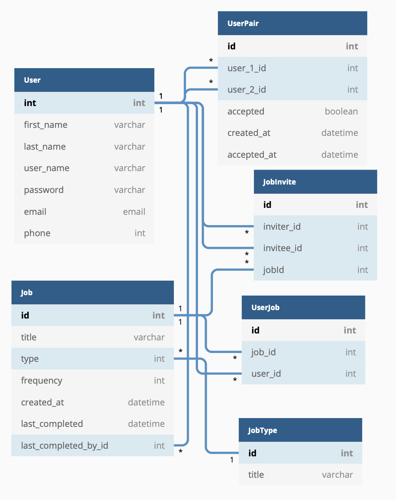

# Oil
A mobile-first web application to remind a user of their long-standing, recurring commitments - oil the mower, change the air filter, clean the fish tank, etc.

This project will be deployed (complete with an actual README) by Friday, June 25, 2021.

In the meantime, if you're looking for a better example of my README writing, please check out [TipHat](https://github.com/subtleco/tiphat)

### [Proposal](https://docs.google.com/document/d/1M-ca4kgNt_PwUpoWO7nD-wDve2ZKk1Ua0C4cONlftiA/edit)

### [ERD](https://dbdiagram.io/d/60be8c58b29a09603d186069)

### Wireframes

